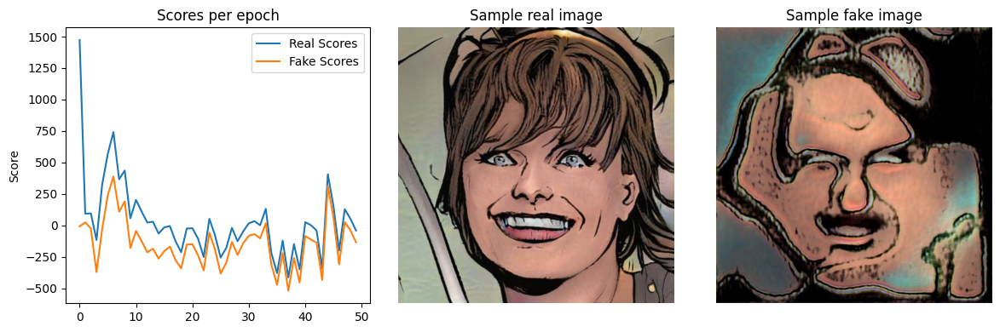

# StyleGAN in PyTorch from Scratch

In this project, we implement the basic generator and discriminator from the [StyleGAN](https://arxiv.org/abs/1812.04948) paper.

The entire project is written in the jupyter notebook file provided. Running
the notebook generates training outputs, models weights, and code files for
model definition and inference.

The generated code files present in this repo are as follows

- model.py contains all the necassary class definitions and helper functions
- inference.py contains minimal code to generate a single image from the best model on cpu
